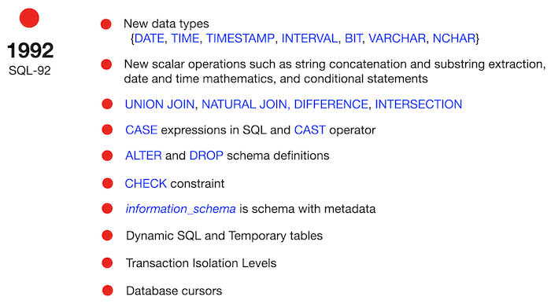
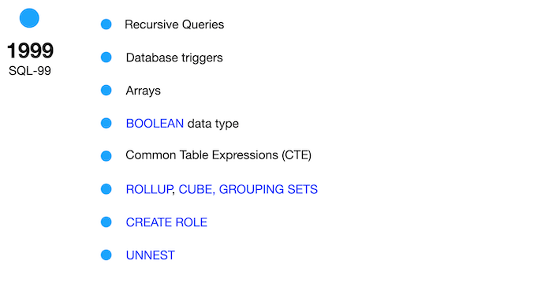
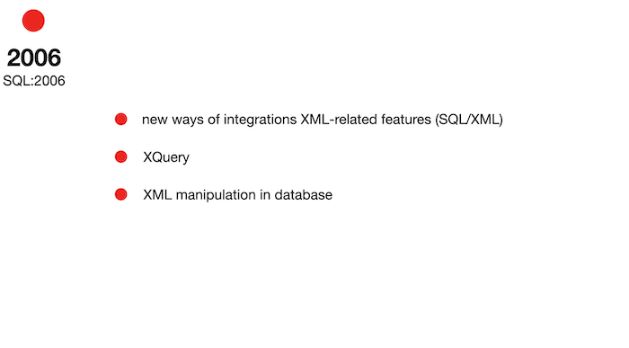

# Day 00 - Piscine SQL

## _Реляционная модель данных и SQL_

Резюме: Сегодня вы увидите, как работает реляционная модель и как получить необходимые данные на основе базовых конструкций SQL

## Contents

1. [Chapter I](#chapter-i) \
    1.1. [Preamble](#preamble)
2. [Chapter II](#chapter-ii) \
    2.1. [General Rules](#general-rules)
3. [Chapter III](#chapter-iii) \
    3.1. [Rules of the day](#rules-of-the-day)  
4. [Chapter IV](#chapter-iv) \
    4.1. [Exercise 00 - First steps into SQL world](#exercise-00-first-steps-into-sql-world)  
5. [Chapter V](#chapter-v) \
    5.1. [Exercise 01 - First steps into SQL world](#exercise-01-first-steps-into-sql-world)  
6. [Chapter VI](#chapter-vi) \
    6.1. [Exercise 02 - First steps into SQL world](#exercise-02-first-steps-into-sql-world)  
7. [Chapter VII](#chapter-vii) \
    7.1. [Exercise 03 - First steps into SQL world](#exercise-03-first-steps-into-sql-world)  
8. [Chapter VIII](#chapter-viii) \
    8.1. [Exercise 04 - First steps into SQL world](#exercise-04-first-steps-into-sql-world)
9. [Chapter IX](#chapter-ix) \
    9.1. [Exercise 05 - First steps into SQL world](#exercise-05-first-steps-into-sql-world)
10. [Chapter X](#chapter-x) \
    10.1. [Exercise 06 - First steps into SQL world](#exercise-06-first-steps-into-sql-world)
11. [Chapter XI](#chapter-xi) \
    11.1. [Exercise 07 - First steps into SQL world](#exercise-07-first-steps-into-sql-world)
12. [Chapter XII](#chapter-xii) \
    12.1. [Exercise 08 - First steps into SQL world](#exercise-08-first-steps-into-sql-world)
13. [Chapter XIII](#chapter-xiii) \
    13.1. [Exercise 09 - First steps into SQL world](#exercise-09-first-steps-into-sql-world)

## Chapter I
## Preamble

Стандарты существуют повсюду, и реляционные базы данных также находятся под контролем :-). Честно говоря, в начале 2000-х годов стандарты SQL были более ограниченными. На самом деле, когда появился шаблон “больших данных”, у реляционных баз данных был свой собственный способ реализации этого шаблона, и поэтому стандарты сейчас более... легкие.

Пожалуйста, ознакомьтесь с некоторыми стандартами SQL, приведенными ниже, и попытайтесь представить себе будущее реляционных баз данных.

|  |  |
| ------ | ------ |
|  |  |
|  |  |
|  |  |

## Chapter II
## Общие правила

- Используйте эту страницу в качестве единственной ссылки. Не прислушивайтесь к слухам и домыслам о том, как подготовить ваше решение.
- Убедитесь, что вы используете последнюю версию PostgreSQL.
- Совершенно нормально, если вы используете IDE для написания исходного кода (он же SQL-скрипт).
- Чтобы ваше решение было оценено, оно должно находиться в вашем репозитории GIT.
- Ваши решения будут оцениваться вашими коллегами.
- Вы не должны оставлять в своем каталоге никаких файлов, кроме тех, которые явно указаны в инструкциях к упражнению. Рекомендуется изменить свой файл `.gitignore' во избежание несчастных случаев.
- У вас есть вопрос? Спросите своего соседа справа. В противном случае попробуйте обратиться к соседу слева.
- Ваше справочное руководство: mates / Internet / Google. 
- Внимательно прочитайте примеры. Возможно, вам понадобятся вещи, не указанные в теме.
- И да пребудет с вами сила SQL!
- В SQL можно представить абсолютно все! Давайте начнем и повеселимся!

## Chapter III
## Правила дня

- Пожалуйста, убедитесь, что у вас есть собственная база данных и доступ к ней в вашем кластере PostgreSQL.
- Пожалуйста, скачайте [script](materials/model.sql) с моделью базы данных здесь и примените скрипт к своей базе данных (вы можете использовать командную строку с psql или просто запустить его через любую IDE, например, DataGrip от JetBrains или pgAdmin от PostgreSQL community).
- Все задачи содержат список разрешенных и запрещенных разделов с указанием параметров базы данных, типов баз данных, конструкций SQL и т.д. Пожалуйста, ознакомьтесь с этим разделом перед началом работы.
- Пожалуйста, ознакомьтесь с логическим представлением нашей модели базы данных.

1. **pizzeria** table (Таблица-справочник с доступными пиццериями)
- field id - первичный ключ
- field name - название пиццерии
- field rating - средняя оценка пиццерии (от 0 до 5 баллов)

2. **person** table (Таблица-словарь с людьми, которые любят пиццу)
- field id - первичный ключ
- field name - имя человека
- field age - возраст человека
- field gender - пол человека
- field address - адрес человека

3. **menu** table (Таблица-справочник с доступным меню и ценой на конкретную пиццу)
- field id - первичный ключ
- field pizzeria_id - внешний ключ для пиццерии
- field pizza_name - название пиццы в пиццерии
- field price - цена конкретной пиццы

4. **person_visits** table (Оперативная таблица с информацией о посещениях пиццерии)
- field id - первичный ключ
- field person_id - внешний ключ для пользователя
- field pizzeria_id - внешний ключ для пиццерии
- field visit_date - дата (например, 2022-01-01) личного визита

5. **person_order** table (Оперативная таблица с информацией о заказах клиентов)
- field id - первичный ключ
- field person_id - внешний ключ для пользователя
- field menu_id - внешний ключ для доступа к меню
- field order_date - дата (например, 2022-01-01) личного заказа 

Данные о посещении и заказе посетителей - это разные объекты, и между ними нет никакой корреляции. Например, клиент может находиться в ресторане (просто просматривая меню) и в то же время делать заказ в другом ресторане с помощью телефона или мобильного приложения. Или в другом случае просто будьте дома и снова сделайте звонок с заказом без каких-либо визитов.

## Chapter IV
## Exercise 00 - Первые шаги в мире SQL

| Exercise 00: Первые шаги в мире SQL |                                                                                                                          |
|---------------------------------------|--------------------------------------------------------------------------------------------------------------------------|
| Turn-in directory                     | ex00                                                                                                                     |
| Files to turn-in                      | `day00_ex00.sql`                                                                                 |
| **Allowed**                               |                                                                                                                          |
| Language                        | ANSI SQL                                                                                              |

Давайте выполним наше первое задание.

Пожалуйста, составьте инструкцию select, которая возвращает имена и возраст всех людей из города ‘Казань’.

## Chapter V
## Exercise 01 - Первые шаги в мире SQL

| Exercise 01: Первые шаги в мире SQL |                                                                                                                          |
|---------------------------------------|--------------------------------------------------------------------------------------------------------------------------|
| Turn-in directory                     | ex01                                                                                                                     |
| Files to turn-in                      | `day00_ex01.sql`                                                                                 |
| **Allowed**                               |                                                                                                                          |
| Language                        | ANSI SQL                                                                                              |

Пожалуйста, введите запрос select, который вернет имена и возраст всех женщин из города Казань. Да, и, пожалуйста, отсортируйте результат по имени.

## Chapter VI
## Exercise 02 - Первые шаги в мире SQL

| Exercise 02: Первые шаги в мире SQL | |
|-|-|
| Turn-in directory | ex02 |
| Files to turn-in | `day00_ex02.sql` |
| **Allowed** | |
| Language | ANSI SQL |

Пожалуйста, составьте 2 инструкции select с разным синтаксисом, которые возвращают список пиццерий (название пиццерии и рейтинг) с рейтингом от 3,5 до 5 баллов (включая предельные баллы) и упорядоченных по рейтингу пиццерий.
- первый оператор select должен содержать знаки сравнения (<=, >=);
- второй оператор select должен содержать ключевое слово `BETWEEN`.

## Chapter VII
## Exercise 03 - Первые шаги в мире SQL

| Exercise 03: Первые шаги в мире SQL | |
|-|-|
| Turn-in directory  |  ex03 |
| Files to turn-in | `day00_ex03.sql` |
| **Allowed**  | |
| Language  | ANSI SQL |

|||
-|-
Please make a select statement that returns the person identifiers (without duplicates) who visited pizzerias in a period from January 6, 2022 to January 9, 2022 (including all days) or visited pizzerias with identifier 2. Also include ordering clause by person identifier in descending mode. | Пожалуйста, заполните запрос, в котором будут указаны идентификаторы пользователей (без дублирования), которые посещали пиццерии в период с 6 по 9 января 2022 года (включая все дни) или посещали пиццерии с идентификатором 2. Также включите предложение о упорядочении по идентификатору пользователя в режиме убывания.

## Chapter VIII
## Exercise 04 - First steps into SQL world

| Exercise 04: First steps into SQL world |                                                                                                                          |
|---------------------------------------|--------------------------------------------------------------------------------------------------------------------------|
| Turn-in directory                     | ex04                                                                                                                     |
| Files to turn-in                      | `day00_ex04.sql`                                                                                 |
| **Allowed**                               |                                                                                                                          |
| Language                        | ANSI SQL                                                                                              |

Please make a select statement which returns one calculated field with name ‘person_information’ in one string like described in the next sample:

`Anna (age:16,gender:'female',address:'Moscow')`

Finally, please add the ordering clause by calculated column in ascending mode.
Please pay attention to the quotation marks in your formula!

## Chapter IX
## Exercise 05 - First steps into SQL world

| Exercise 05: First steps into SQL world |                                                                                                                          |
|---------------------------------------|--------------------------------------------------------------------------------------------------------------------------|
| Turn-in directory                     | ex05                                                                                                                     |
| Files to turn-in                      | `day00_ex05.sql`                                                                                 |
| **Allowed**                               |                                                                                                                          |
| Language                        | ANSI SQL                                                                                              |
| **Denied**                               |                                           
| SQL Syntax Construction                        | `IN`, any types of `JOINs`                                                                                              |

Write a select statement that returns the names of people (based on an internal query in the `SELECT` clause) who placed orders for the menu with identifiers 13, 14, and 18, and the date of the orders should be January 7, 2022. Be careful with "Denied Section" before your work.

Please take a look at the pattern of internal query.

    SELECT 
	    (SELECT ... ) AS NAME  -- this is an internal query in a main SELECT clause
    FROM ...
    WHERE ...

## Chapter X
## Exercise 06 - First steps into SQL world

| Exercise 06: First steps into SQL world |                                                                                                                          |
|---------------------------------------|--------------------------------------------------------------------------------------------------------------------------|
| Turn-in directory                     | ex06                                                                                                                     |
| Files to turn-in                      | `day00_ex06.sql`                                                                                 |
| **Allowed**                               |                                                                                                                          |
| Language                        | ANSI SQL                                                                                              |
| **Denied**                               |                                           
| SQL Syntax Construction                        | `IN`, any types of `JOINs`                                                                                              |

Use the SQL construction from Exercise 05 and add a new calculated column (use column name ‘check_name’) with a check statement a pseudocode for this check is given below) in the `SELECT` clause.

    if (person_name == 'Denis') then return true
        else return false

## Chapter XI
## Exercise 07 - First steps into SQL world

| Exercise 07: First steps into SQL world |                                                                                                                          |
|---------------------------------------|--------------------------------------------------------------------------------------------------------------------------|
| Turn-in directory                     | ex07                                                                                                                     |
| Files to turn-in                      | `day00_ex07.sql`                                                                                 |
| **Allowed**                               |                                                                                                                          |
| Language                        | ANSI SQL                                                                                              |

Let's apply data intervals to the `person` table. 
Please make an SQL statement that returns the identifiers of a person, the person's names, and the interval of the person's ages (set a name of a new calculated column as 'interval_info') based on the pseudo code below.

    if (age >= 10 and age <= 20) then return 'interval #1'
    else if (age > 20 and age < 24) then return 'interval #2'
    else return 'interval #3'

And yes... please sort a result by ‘interval_info’ column in ascending mode.

## Chapter XII
## Exercise 08 - First steps into SQL world

| Exercise 08: First steps into SQL world |                                                                                                                          |
|---------------------------------------|--------------------------------------------------------------------------------------------------------------------------|
| Turn-in directory                     | ex08                                                                                                                     |
| Files to turn-in                      | `day00_ex08.sql`                                                                                 |
| **Allowed**                               |                                                                                                                          |
| Language                        | ANSI SQL                                                                                              |

Create an SQL statement that returns all columns from the `person_order` table with rows whose identifier is an even number. The result must be ordered by the returned identifier.

## Chapter XIII
## Exercise 09 - First steps into SQL world

| Exercise 09: First steps into SQL world |                                                                                                                          |
|---------------------------------------|--------------------------------------------------------------------------------------------------------------------------|
| Turn-in directory                     | ex09                                                                                                                     |
| Files to turn-in                      | `day00_ex09.sql`                                                                                 |
| **Allowed**                               |                                                                                                                          |
| Language                        | ANSI SQL                                                                                              |
| **Denied**                               |                                           
| SQL Syntax Construction                        | any types of `JOINs`                                                                                              |

Please make a select statement that returns person names and pizzeria names based on the `person_visits` table with a visit date in a period from January 07 to January 09, 2022 (including all days) (based on an internal query in the `FROM' clause).

Please take a look at the pattern of the final query.

    SELECT (...) AS person_name ,  -- this is an internal query in a main SELECT clause
            (...) AS pizzeria_name  -- this is an internal query in a main SELECT clause
    FROM (SELECT … FROM person_visits WHERE …) AS pv -- this is an internal query in a main FROM clause
    ORDER BY ...

Please add a ordering clause by person name in ascending mode and by pizzeria name in descending mode.

